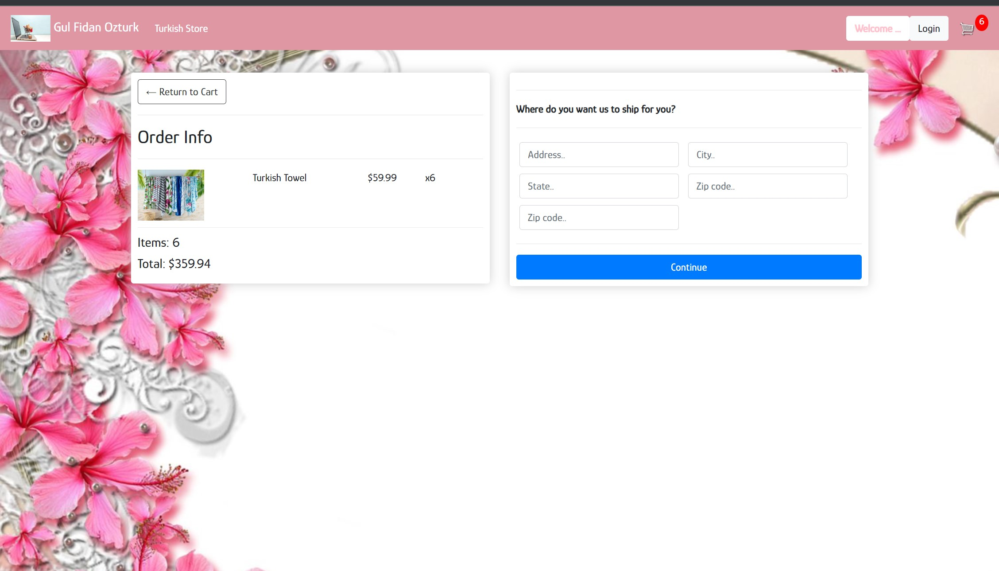

<strong>Online Shopping!</strong> 
This is a fully operational online shopping platform with an attractive interface and powerful backend capabilities.

<strong>Characteristics</strong> 
The ability for users to check out as guests or registered members. 
The establishment of templates and data structure in the initial two modules. 
Incorporation of user checkout flow, including payment integration. 
Once a user is logged in, they can complete a standard checkout. 
Guest checkout capability utilizing cookies. 

<strong>Technologies</strong> 
Django (Backend) 
Bootstrap (Frontend) 
CSS (Frontend) 
JavaScript (Client-Side) 
Paypal Integration (Payment Gateway) 

<strong>Website View</strong>

<strong>To Run This Project</strong>  
<svg xmlns="http://www.w3.org/2000/svg" viewBox="0 0 384 512"><!--! Font Awesome Pro 6.4.0 by @fontawesome - https://fontawesome.com License - https://fontawesome.com/license (Commercial License) Copyright 2023 Fonticons, Inc. --><path d="M384 312.7c-55.1 136.7-187.1 54-187.1 54-40.5 81.8-107.4 134.4-184.6 134.7-16.1 0-16.6-24.4 0-24.4 64.4-.3 120.5-42.7 157.2-110.1-41.1 15.9-118.6 27.9-161.6-82.2 109-44.9 159.1 11.2 178.3 45.5 9.9-24.4 17-50.9 21.6-79.7 0 0-139.7 21.9-149.5-98.1 119.1-47.9 152.6 76.7 152.6 76.7 1.6-16.7 3.3-52.6 3.3-53.4 0 0-106.3-73.7-38.1-165.2 124.6 43 61.4 162.4 61.4 162.4.5 1.6.5 23.8 0 33.4 0 0 45.2-89 136.4-57.5-4.2 134-141.9 106.4-141.9 106.4-4.4 27.4-11.2 53.4-20 77.5 0 0 83-91.8 172-20z"/></svg> clone this project on your local machine,
git clone https://github.com/gulfidan34/EcommerceTurkish  
* create a virtual environment inside eCommerce folder,
virtualenv venv
* activate virtual environment,(for windows)
.\venv\Scripts\activate   
* install project dependencies from requirements.txt,
pip install -r requirements.txt  
* run project on your local machine,
python manage.py runserver  
